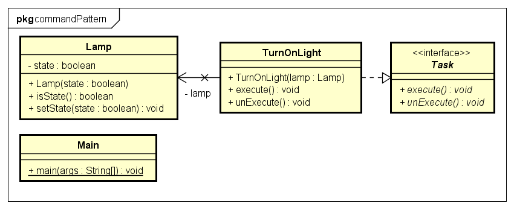

[[back](../README.md)]

# Command Pattern

## Problem

Man hat viele Funktionen die man außerhalb von anderen Klassen implementieren will. Meißtens wird das Command Pattern verwendet um den wichtigen Code an einer Stelle zu haben und nicht z.B. eine Model-Klasse bearbeiten zu müssen. Ein weiterer Grund warum man soetwas machen wollen würde ist, dass mehrere Personen an den Funktionen schreiben und man es so besser aufteilen kann.

## Beispiel

Bei einer Fernbedienung sollen sie Funktionen der einzelnen Knöpfe frei zuweisbar sein. 

## Lösung

Die einzelnen Funktionen der Fernbedienung werden als Tasks in eigenen Klassen implementiert.

## UML



## Code

1) Als erstes muss ein Task Interface geschrieben werden.

> Die unExecute Methode wird nicht immer verwendet

```java
public interface Task {
    public void execute();
    public void unExecute();
}
```

2) Dann können die einzelnen Tasks implementiert werden

```java
public class TurnOnLight implements Task{

    private Lamp lamp;

    public TurnOnLight(Lamp lamp) {
        this.lamp = lamp;
    }

    @Override
    public void execute() {
        ...
    }

    @Override
    private void unExecute(){
    	...
    }
}
```
Bei der Implementierung ist es wichtig, dass im Konstruktor nur Attribute gesetzt werden. In der `execute()` Methode soll dann die Logik der Klasse geschrieben werden.

2) Als Letztes müssen die Commands nur noch aufgerufen werden

```java
public class Main{
	public static void main(String[] args){
		Lamp lamp = Lamp.getLamp(...);
		Task t = new TurnOnLight(lamp);
		t.execute();
		t.unExecute();
	}
}
```
