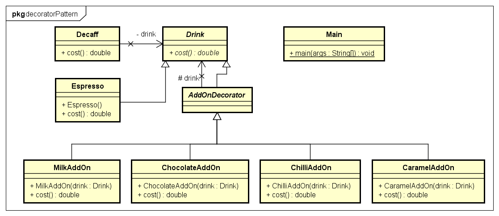

[[back](../)]

# Decorator Pattern

## Problem

Klassenexplosion

## Beispiel

Ein Kaffehaus will den Preis seiner Getränke mit einem Programm berechnen. Aber da man zu jedem Getränk noch belibig viele Zusätze dazugeben kann bräuchte man für jede Kombination eine eigene Klasse oder ein komplexes Variablenkonstrukt.

## Lösung

Man erstellt eine abstrakte Klasse z.B.: Getraenk, von der alle Basisgetränke und die AddOnDecorator Klasse erben. Die Einzelnen Addons erben von der abstrakten AddOnDecorator Klasse und haben ein Attribut der Klasse Getraenk und sind damit Vererbungsmäßig ein Getraenk aber sie haben auch ein Getraenk als Variable. Um Jetzt ein Getränk zu erstellen muss man zuerst ein Basisgetränk haben welches man dann in den verschiedenen AddOns einwickelt. Das wird gemacht indem man sein Getränk einem AddOn als Variable mitgibt. Wenn man jetzt den Preis eines Getränks wissen möchte muss man nur die cost() Methode des "obersten" Objekts aufrufen, welches dann seinen Preis und den Preis des Attribut-Getränks zurück.

## UML



## Code

Als erstes müssen zwei abstrakte Klassen erstellt werden:

* Die Gertaenk Klasse mit der abstrakten methode cost()
* Die AddOnDecorator Klasse die eine Subklasse von Geraenk ist

```java

public abstract class Drink{
	public abstract double cost();
}

public abstract class AddOnDecorator extends Drink{
	protected Drink drink;
}

```

Dann werden die eigentlichen Getränke und AddOns implementiert

```java

public class Espresso extends Drink{

	public double cost(){
		return 1.50;
	}
}

public class Decaffinated extends Drink{
	public double cost(){
		return 1.50;
	}
}

public class CaramelAddOn extends AddOnDecorator{

	public CaramelAddOn(Drink drink){
		this.drink = drink;
	}

	public double cost(){
		return this.drink.cost() + 0.3;
	}
}

public class ChocolateAddOn extends AddOnDecorator{

	public ChocolateAddOn(Drink drink){
		this.drink = drink;
	}

	public double cost(){
		return this.drink.cost() + 0.2;
	}
}

public class MilkAddOn extends AddOnDecorator{

	public MilkAddOn(Drink drink){
		this.drink = drink;
	}

	public double cost(){
		return this.drink.cost() + 0.1;
	}
}

public class ChilliAddOn extends AddOnDecorator{

	public ChilliAddOn(Drink drink){
		this.drink = drink;
	}

	public double cost(){
		return this.drink.cost() + 0.5;
	}
}

```

Letztens können die verschiedenen Kaffes erstellt werden

```java

public class Main{
	public static void main(String[] args){
		Drink kaffe1 = new CaramelAddOn(new ChilliAddOn(new Espresso()));
		Drink kaffe2 = new MilkAddOn(new ChocolateAddOn(new Decaffinated()));
	}
}

```
