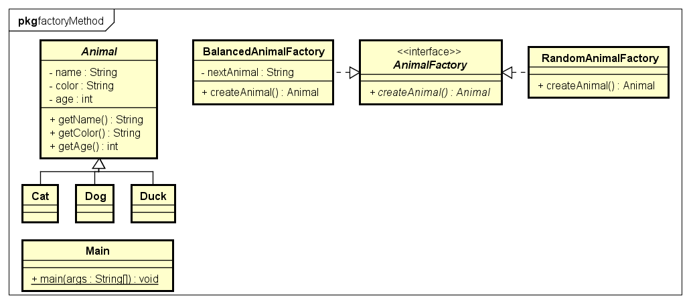

# Factory Pattern

## Problem

Zum erstellen eines Objekts braucht man mehr Code als nur ```new``` (z.B.: Um herauszufinden Welche Implementierung oder welche Parameter).Wenn man ein Objekt mit dem genau gleichen Ablauf mehrmals erstellen muss, fällt einem auf, dass man gegen den ersten Grundsatz von Patterns verstöst: Veränderbares von unveränderbarem Trennen. 

## Beispiel

In einer Simulation sollen Tiere erstellt werden. Es soll 2 Wege geben ein neues Tier zu erstellen:

* createRandomAnimal: erzeugt bei jedem Aufruf ein zufälliges Tier
* createBalancedAnimal: balanciert die Anzahl der einzelnen Tiere durch logik aus.

Es gibt 3 Tiere welche folgendermaßen implemenTIERt sind:

```java
public abstract class Animal{
    private String name;
    private String color;
    private int age;
}

public class Dog extends Animal{

}

public class Cat extends Animal{

}

public class Duck extends Animal{

}
```

## Simple Factory

> Die Simple Factory ist kein echtes Pattern. Es ist eine Vereinfachung der Factory Method. 

### Lösung

Es wird eine Klasse erstellt, die von keiner Klasse erbt und kein Interface implementiert. In dieser Klasse gibt es 2 Methoden:

* createRandomAnimal
* createBalancedAnimal

### UML


### Code

```java
public abstract class AnimalFactory{

    public Animal getRandomAnimal(){
        int rnd = (int) Math.random() * 3;

        if(rnd == 3){
            return new Dog();
        }else if(rnd == 2){
            return new Cat();
        }else{
            return new Duck();
        }
    }

    private String nextAnimal;

    public Ainimal getBalancedAnimal(){
        if(nextAnimal == "Dog"){

            nextAnimal = "Cat";
            return new Dog();

        }else if(nextAnimal == "Cat"){

            nextAnimal = "Duck";
            return new Cat();

        }else if(nextAnimal == "Duck"){

            nextAnimal = "Dog";
            return new Duck();

        }else{
            nextAnimal = "Cat";
            return new Dog();
        }
    }
}
```

## Factory Method

> Bei der Factory Method implementiert jede Factory ein Interface oder erbt von einer Superklasse. Die erstellung der Objekte wird den subklassen/implementierungen überlassen

### Lösung

Es wird ein Interface `AnimalFactory` erstellt, welches eine `createAnimal` Methode fordert. Das Interface wird dann von 2 Klassen implementiert:

* RandomAnimalFactory: erstellt die Tiere zufällig
* BalancedAnimalFactory: gleicht die Tieranzahl durch Code aus


### UML



### Code

```java
public interface AnimalFactory{
    public Animal createAnimal();
}

public class RandomAnimalFactory implements AnimalFactory{
    
    @Override
    public Animal createAnimal(){
        int rnd = (int) Math.random() * 3;

        if(rnd == 3){
            return new Dog();
        }else if(rnd == 2){
            return new Cat();
        }else{
            return new Duck();
        }
    }
}

public class BalancedAnimalFactory implements AnimalFactory{

    private String nextAnimal;

    @Override
    public Animal createAnimal(){
        if(nextAnimal == "Dog"){

            nextAnimal = "Cat";
            return new Dog();

        }else if(nextAnimal == "Cat"){

            nextAnimal = "Duck";
            return new Cat();

        }else if(nextAnimal == "Duck"){

            nextAnimal = "Dog";
            return new Duck();

        }else{
            nextAnimal = "Cat";
            return new Dog();
        }
    }

}
```

## Abstract Factory

> Die Abstract Factory ist eine Erweiterung der Factory Method. Beim Abstract Factory Pattern werden mehrere ähnliche Factory Methods in der Selben Factory implementiert.

### Lösung

In der Simulation sollen jetzt auch Bäume erstellt werden. Dazu wird ein Organismus Factory Interface erstellt welches die 2 Factory Methods verlangt. Das Interface wird dann von 2 Factorys implementiert.

### UML


### Code

```java
public interface OrganismFactory{
    public Organism createBalanced();
    public Organism createRandom();
}

public class AnimalFactory implements OrganismFactory{

    private String nextAnimal;
    
    @Override
    public Animal createRandom(){
        int rnd = (int) Math.random() * 3;

        if(rnd == 3){
            return new Dog();
        }else if(rnd == 2){
            return new Cat();
        }else{
            return new Duck();
        }
    }

    @Override
    public Animal createBalanced(){
        if(nextAnimal == "Dog"){

            nextAnimal = "Cat";
            return new Dog();

        }else if(nextAnimal == "Cat"){

            nextAnimal = "Duck";
            return new Cat();

        }else if(nextAnimal == "Duck"){

            nextAnimal = "Dog";
            return new Duck();

        }else{
            nextAnimal = "Cat";
            return new Dog();
        }
    }
}

public class TreeFactory implements OrganismFactory{

    private String nextTree;

    @Override
    public Tree createRandom(){
        int rnd = (int) Math.random() * 3;

        if(rnd == 3){
            return new Oak();
        }else if(rnd == 2){
            return new Birch();
        }else{
            return new Sprouce();
        }
    }

    @Override
    public Tree createBalanced(){
        if(nextTree == "Oak"){

            nextTree = "Birch";
            return new Oak();

        }else if(nextTree == "Birch"){

            nextTree = "Sprouce";
            return new Birch();

        }else if(nextTree == "Sprouce"){

            nextTree = "Oak";
            return new Sprouce();

        }else{
            nextTree = "Oak";
            return new Sprouce();
        }
    }

}
```
