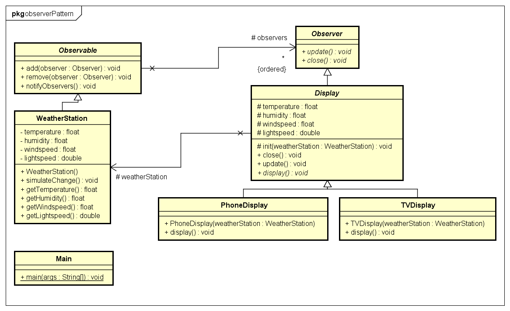

# Observer Pattern

## Problem

Viele Objekte wollen wissen wenn sich ein Objekt ändert

## Beispiel

Es wird eine Wetterstation aufgestellt die mehrere Wetterdaten misst. Viele Displays wollen wissen wann sich die Wetterdaten ändern.

## Lösung

Man erstellt ein Objekt (Observable) das die gewünschten Daten und eine Collection der Objekte die benachrichtigt werden wollen. Die Objekte die wissen wollen wann sich die Daten ändern (Observer) können sich beim Observable registrieren und abmelden.

## UML

## Code

Als erstes müssen drei abstrakte Klassen erstellt werden:

* Die Observable Klasse mit den Methoden add(), remove(), notifyObservers()
* Die Observer Klasse mit der Methode update()
* Die Display Klasse mit den Methoden init(), close(), update()

```java

public abstract class Observable{
    // Die Liste der angemeldeten Observer
    protected ArrayList<Observer> observers = new ArrayList();

    /**
     * Wird vom Observer zum anmelden am Observable verwendet
     * @param observer der Observer der angemeldet werden soll
     */
    public void add(Observer observer){
        this.observers.add(observer);
    }

    /**
     * Wird vom Observer zum abmelden vom Observable verwendet
     * @param observer der Observer der abgemeldet werden soll
     */
    public void remove(Observer observer){
        this.observers.remove(observer);
    }

    /**
     * Benachrichtigt die Observer, dass sich die Daten geändert haben
     */
    public void notifyObservers(){
        for(int i = 0; i < observers.size(); i++){
            observers.get(i).update();
        }
    }
}

public abstract class Observer{

    /**
     * Aktualisiert die gespeicherten Wetterdaten mit denen von der Wetterstation
     */
    public abstract void update();

    /**
     * Meldet das Display von der Wetterstation ab
     */
    public abstract void close();
}

public abstract class Display extends Observer{

    protected WeatherStation weatherStation;

    protected float temperature;
    protected float humidity;
    protected float windspeed;
    protected double lightspeed;

    /**
     * Initialisiert Den Display indem er sich bei der Wetterstation anmeldet und die aktuellen Daten anzeigt
     * @param weatherStation Die Wetterstation bei der sich das Display anmelden soll
     */
    protected void init(WeatherStation weatherStation){
        this.weatherStation = weatherStation;
        this.weatherStation.add(this);

        this.update();
    }

    public void close(){
        this.weatherStation.remove(this);
    }

    public void update(){
        this.temperature = weatherStation.getTemperature();
        this.humidity = weatherStation.getHumidity();
        this.windspeed = weatherStation.getWindspeed();
        this.lightspeed = weatherStation.getLightspeed();

        this.display();
    }

    /**
     * Zeigt die aktuellen Daten an
     */
    public abstract void display();
}


```

Dann werden die  Weatherstation und Displays implementiert

```java

public class WeatherStation extends Observable{

    private float temperature;
    private float humidity;
    private float windspeed;
    private double lightspeed;

    public WeatherStation(){
        this.temperature = 0;
        this.humidity = 0;
        this.windspeed = 0;
        this.lightspeed = 299792458;
    }

    public void simulateChange(){
        this.temperature = (int) (Math.random() * 50);
        this.humidity = (int) (Math.random() * 100);
        this.windspeed = (int) (Math.random() * 250);
		this.lightspeed = lightspeed + (Math.random() * -0.1);
        notifyObservers();
    }

    public float getTemperature() {
        return temperature;
    }

    public float getHumidity() {
        return humidity;
    }

    public float getWindspeed() {
        return windspeed;
    }

    public double getLightspeed() {
        return lightspeed;
    }

}

public class PhoneDisplay extends Display{

    public PhoneDisplay(WeatherStation weatherStation){
        this.init(weatherStation);
    }

    public void display(){
        System.out.println("----------\n- Temperature: "+this.temperature+"\n- Humidity: "+this.humidity+"\n- Windspeed: "+this.windspeed+"\n- Lightspeed: "+this.lightspeed+"\n----------");
    }

}

public class TVDisplay extends Display{

    public TVDisplay(WeatherStation weatherStation){
        this.init(weatherStation);
    }

    public void display(){
        System.out.println("Temperature: "+this.temperature+" Humidity: "+this.humidity+" Windspeed: "+this.windspeed+" Lightspeed: "+this.lightspeed);
    }
}

```

Letztens können die Weatherstation und Displays erstellt und aktiviert werden

```java

public class Main {

    public static void main(String[] args) {
        WeatherStation w1 = new WeatherStation();
        w1.simulateChange();

        TVDisplay d1 = new TVDisplay(w1);
        PhoneDisplay d2 = new PhoneDisplay(w1);

        w1.simulateChange();

        d1.close();
        d2.close();
    }
}

```
