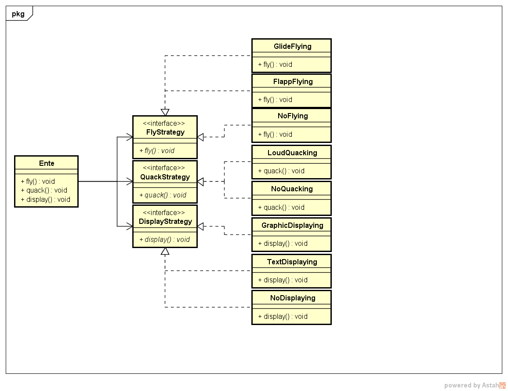

# Design Patterns

## Strategy Pattern

### Grundkonzept:
* Eine Familie von Algorythmen verkapseln und austauschbar machen
* Komposition > Vererbung

### Beispiel

#### Problem:

Die Klasse Ente soll mehrere Subkalassen haben welche teilweise Funktionen gemein haben.
Z.B.: Es gibt 3 verschiedene Arten von Enten von denen 2 die selbe implementation der fly() Methode haben.

### Lösung

Die verschiedenen Enten werden nicht durch Vererbung sondern durch Komposition realisiert. D.H.: Man hat einen Pool an verschienenen Implementationen der verschiedenen Funktionen aus denen man seine Enten à la carte (pick and choose) zusammenstellen kann.

### UML


### Code
Zuerst werden Interfaces für die verschiedenen Funktionen der Ente definiert.

```java
public interface DisplayStrategy{
	public void display();
}

public interface QuackStrategy{
	public void quack();
}

public interface FlyStrategy{
	public void fly();
}
```

Dann kann man die Ente Klasse schreiben in der man in den Funktionen einfach 

```java

public class Ente{
	
	private FlyStrategy flyStrat;
	private QuackStrategy quackStrat;
	private DisplayStrategy displayStrat;

	public Ente(flyStrat, quackStrat, displayStrat){
		this.flyStrat = flyStrat;
		this.quackStrat = quackStrat;
		this.displayStrat = displayStrat;
	}

	public void display(){
		this.displayStrat.display();
	}

	public void fly(){
		this.flyStrat.fly();
	}

	public void quack(){
		this.quackStrat.quack();
	}
}
```

Zuletzt müssen ein paar Implementierungen für die Interfaces geschrieben werden und eine Ente komposiert werden

```java
/*
* Fly Strategies
*/
public class GlideFlying implements FlyStrategy{
	public void fly(){
		//TODO: implement Strategy
	}
}

public class FlappFlying implements FlyStrategy{
	public void fly(){
		//TODO: implement Strategy
	}
}

public class NoFlying implements FlyStrategy{
	public void fly(){
		//TODO: implement Strategy
	}
}

/*
* Quack Strategies
*/
public class LoudQuacking implements QuackStrategy{
	public void quack(){
		//TODO: implement Strategy
	}
}

public class NoQuacking implements QuackStrategy{
	public void quack(){
		//TODO: implement Strategy
	}
}
/*
* Display Strategies
*/
public class GraphicDisplaying implements DisplayStrategy{
	public void display(){
		//TODO: implement Strategy
	}
}

public class TextDisplaying implements DisplayStrategy{
	public void display(){
		//TODO: implement Strategy
	}
}

public class NoDisplaying implements DisplayStrategy{
	public void display(){
		//TODO: implement Strategy
	}
}

public class EnteTest{
	public static void main(String[] args){
		Ente wildeEnte = new Ente(new FlappFlying(), new LoudQuacking(), new GrphicDisplaying());
		Ente parkEnte = new Ente(new NoFlying(), new LoudQuacking(), new GrphicDisplaying());
		Ente rubberDuck = new Ente(new NoFlying(), new NoQuacking(), new GrphicDisplaying());

		wildeEnte.display();
		parkEnte.display();
		rubberDuck.display();

		wildeEnte.quack();
		parkEnte.quack();
		rubberDuck.quack();

		wildeEnte.fly();
		parkEnte.fly();
		rubberDuck.fly();
	}
}
```

## Decorator Pattern

> Grundkonzept:
>

### Beispiel

### Problem

### Lösung

### UML

### Code


## Observer Pattern

> Grundkonzept:
>

### Beispiel

### Problem

### Lösung

### UML

### Code


## Factory Pattern (Simple/Abstract)


## Proxy Pattern

## Adapter Pattern

## Command Pattern
