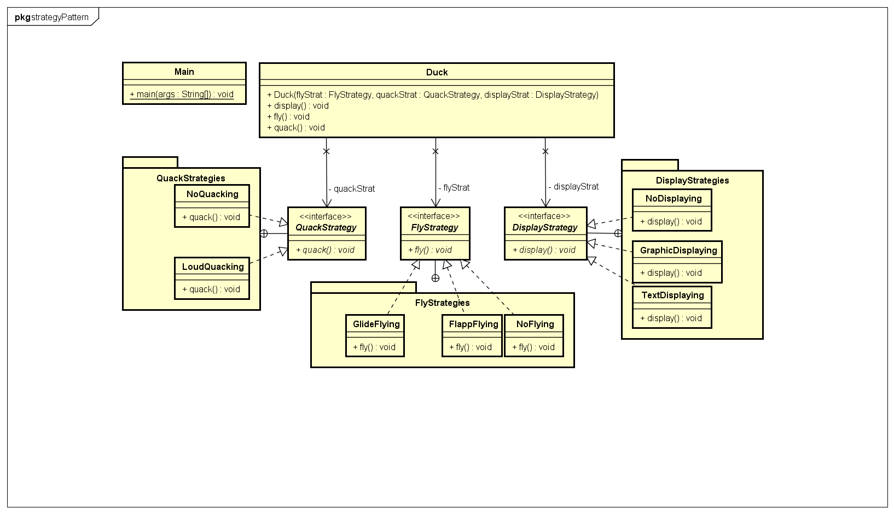

 [[back](../README.md)]
# Strategy Pattern

## Problem:

Funktionalität soll zwischen mehreren Objekten geteilt werden

## Beispiel

Die Klasse Duck soll mehrere Subklassen haben welche teilweise Funktionen gemein haben.
Z.B.: Es gibt 3 verschiedene Arten von Ducks von denen 2 die selbe Implementation der fly() Methode haben.

## Lösung

Die verschiedenen Ducks werden nicht durch Vererbung sondern durch Komposition realisiert. D.H.: Man hat einen Pool an verschienenen Implementationen der verschiedenen Funktionen aus denen man seine Duck à la carte (pick and choose) zusammenstellen kann.

## UML


## Code
Zuerst werden Interfaces für die verschiedenen Funktionen der Duck definiert.

```java

public interface DisplayStrategy{
	public void display();
}

public interface QuackStrategy{
	public void quack();
}

public interface FlyStrategy{
	public void fly();
}

```

Dann kann man die `Duck` Klasse schreiben. In den Funktionen: `display()`, `fly()` und `quack()`, werden die jeweils Gleichheißenden Funktionen der zugehörigen Strategies aufgerufen.

```java

public class Duck{
	
	private FlyStrategy flyStrat;
	private QuackStrategy quackStrat;
	private DisplayStrategy displayStrat;

	public Duck(FlyStrategy flyStrat, QuackStrategy quackStrat, DisplayStrategy displayStrat){
		this.flyStrat = flyStrat;
		this.quackStrat = quackStrat;
		this.displayStrat = displayStrat;
	}

	public void display(){
		this.displayStrat.display();
	}

	public void fly(){
		this.flyStrat.fly();
	}

	public void quack(){
		this.quackStrat.quack();
	}
}
```

Zuletzt müssen ein paar Implementierungen für die Interfaces geschrieben werden und eine Duck erstellt werden

```java
/*
* Fly Strategies
*/
public class GlideFlying implements FlyStrategy{
	public void fly(){
		//TODO: implement Strategy
	}
}

public class FlappFlying implements FlyStrategy{
	public void fly(){
		//TODO: implement Strategy
	}
}

public class NoFlying implements FlyStrategy{
	public void fly(){
		//TODO: implement Strategy
	}
}

/*
* Quack Strategies
*/
public class LoudQuacking implements QuackStrategy{
	public void quack(){
		//TODO: implement Strategy
	}
}

public class NoQuacking implements QuackStrategy{
	public void quack(){
		//TODO: implement Strategy
	}
}
/*
* Display Strategies
*/
public class GraphicDisplaying implements DisplayStrategy{
	public void display(){
		//TODO: implement Strategy
	}
}

public class TextDisplaying implements DisplayStrategy{
	public void display(){
		//TODO: implement Strategy
	}
}

public class NoDisplaying implements DisplayStrategy{
	public void display(){
		//TODO: implement Strategy
	}
}

public class DuckTest{
	public static void main(String[] args){
		Duck wildDuck = new Duck(new FlappFlying(), new LoudQuacking(), new GraphicDisplaying());
		Duck parkDuck = new Duck(new NoFlying(), new LoudQuacking(), new GraphicDisplaying());
		Duck rubberDuck = new Duck(new NoFlying(), new NoQuacking(), new GraphicDisplaying());

		wildDuck.display();
		parkDuck.display();
		rubberDuck.display();

		wildDuck.quack();
		parkDuck.quack();
		rubberDuck.quack();

		wildDuck.fly();
		parkDuck.fly();
		rubberDuck.fly();
	}
}
```
